# Backend Directory Structure and Class Relationships

## Directory Structure

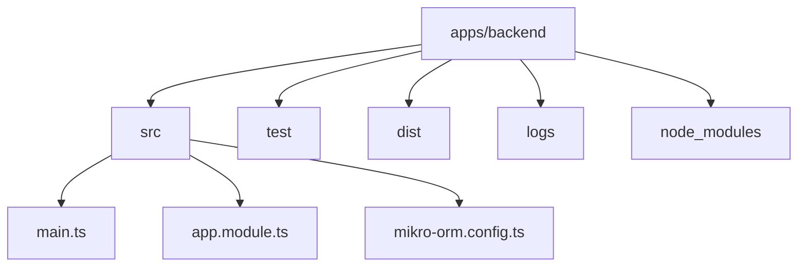
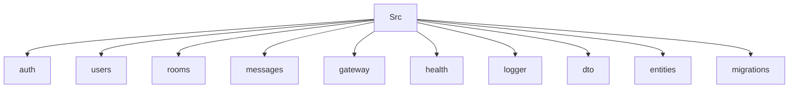

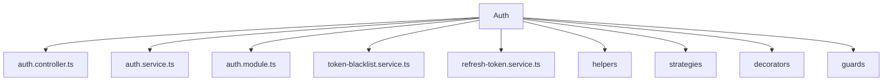

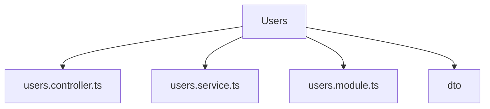

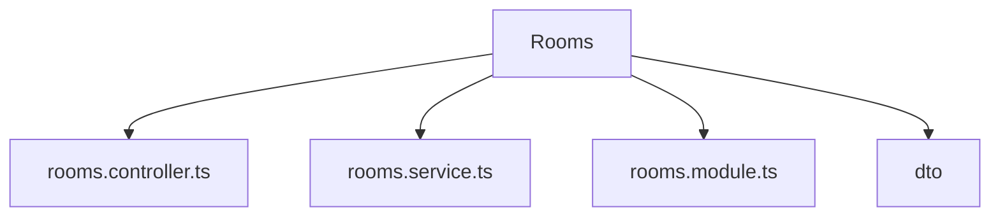

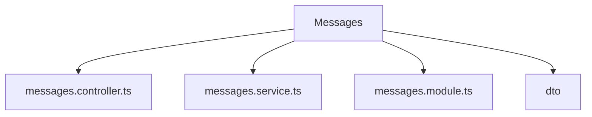

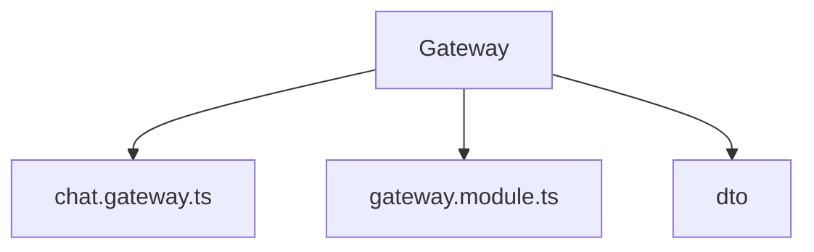

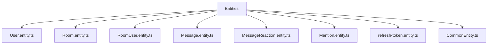

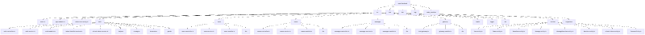

## Module Dependencies

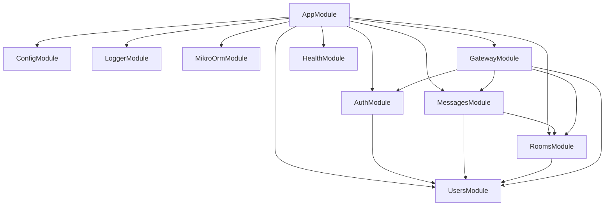

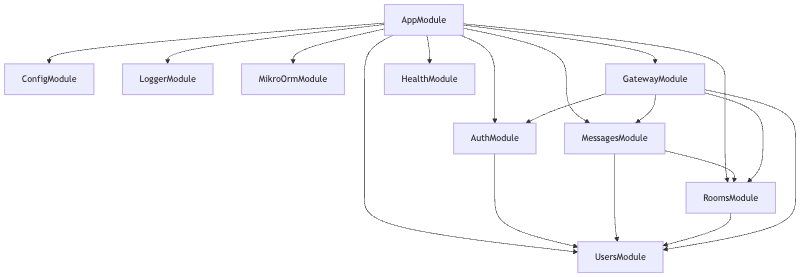

## Entity Relationships

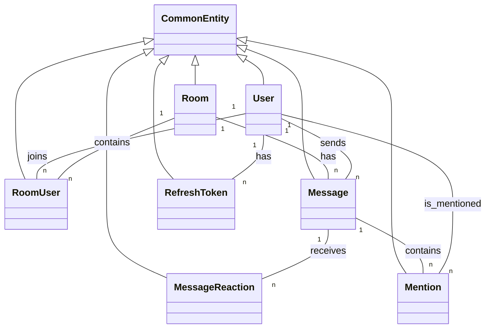

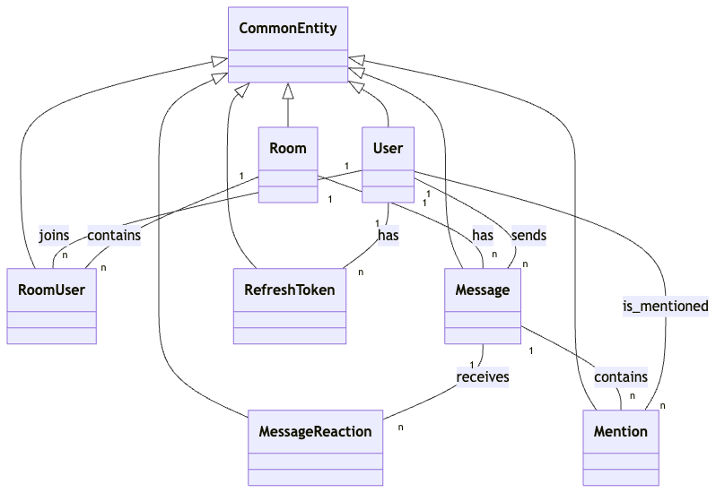

## Class Diagrams

### Entity Classes

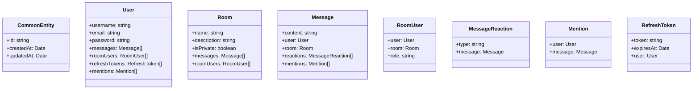

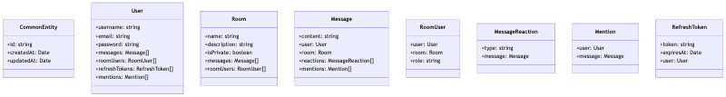

### Service Classes and Dependencies

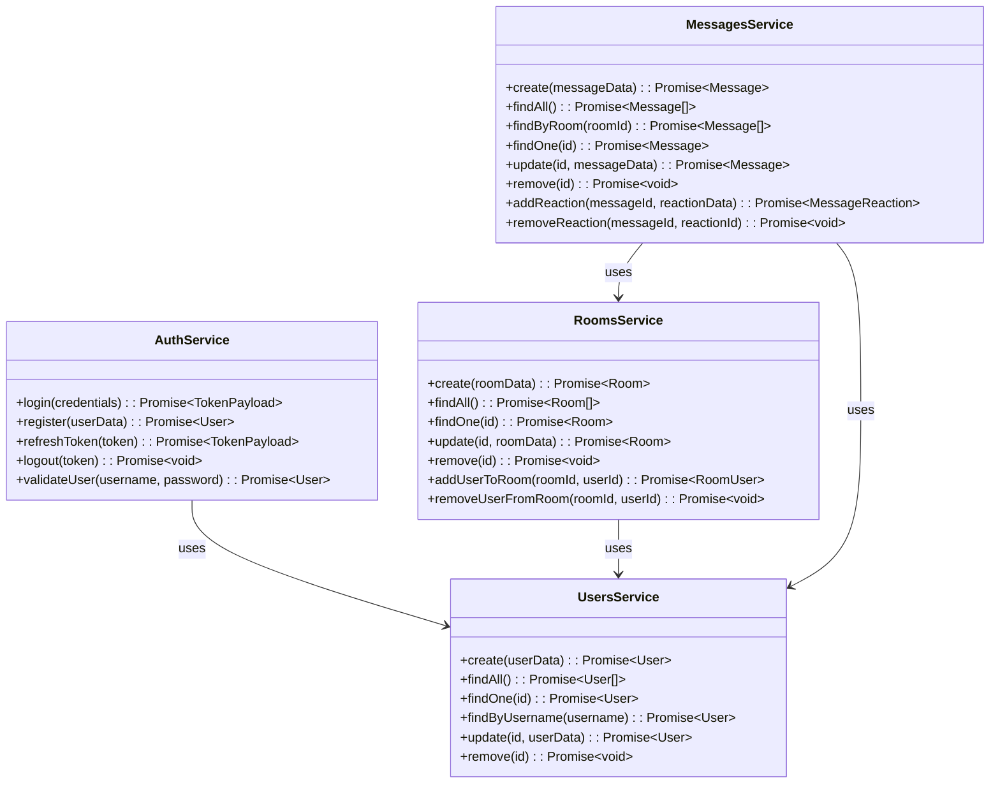

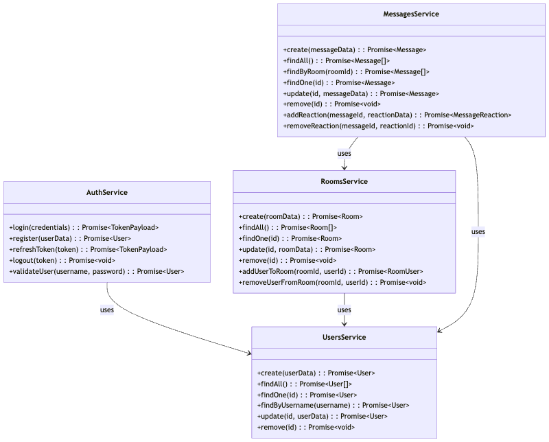

### Controller and Service Dependencies

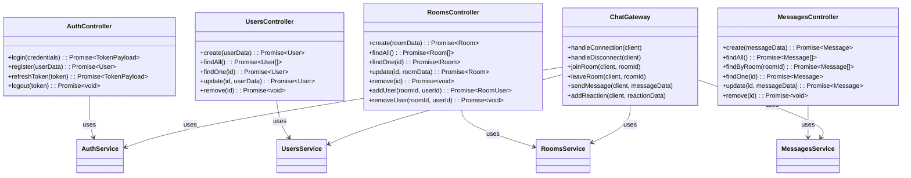

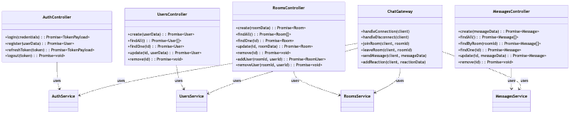

### NestJS Module Relationships

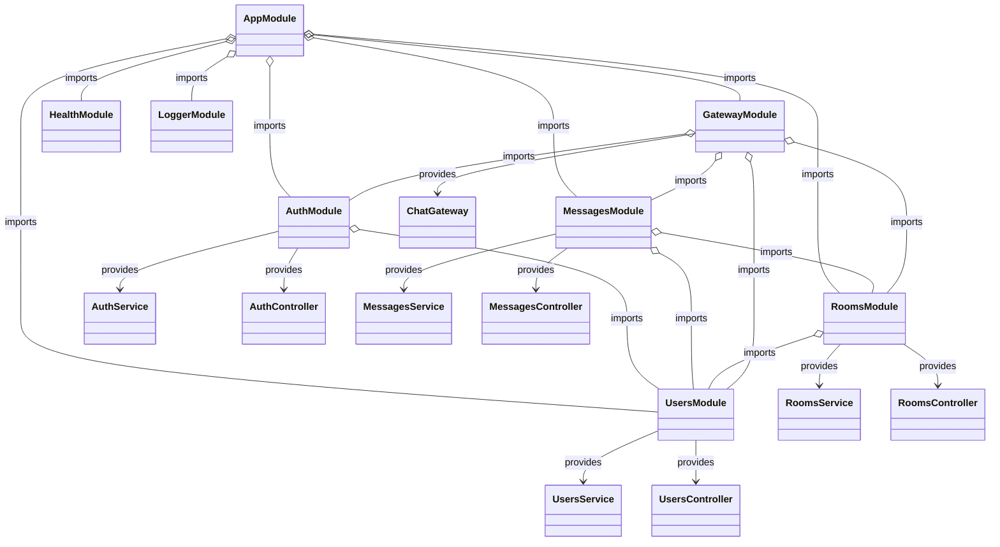

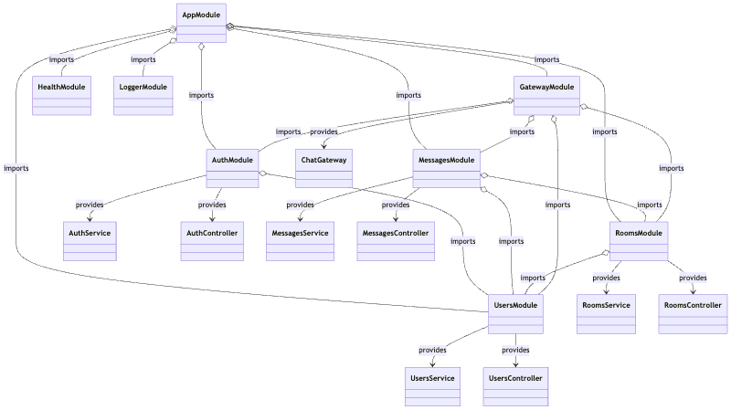
